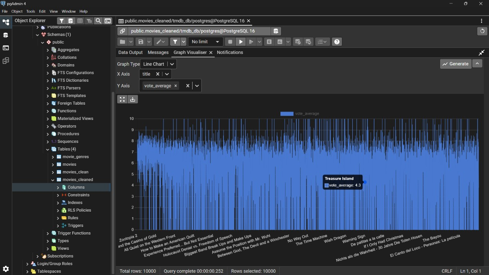

# Movies ETL & Analytics Dashboard

An end-to-end data analytics project that demonstrates building an ETL pipeline using **PySpark**, storing and validating data in **PostgreSQL**, and developing an interactive **Power BI** dashboard to analyze movie trends and support data-driven decision-making.

---

# Project Objectives

- Build a complete ETL pipeline for movie data.
- Clean and transform raw movie data using PySpark.
- Load processed data into PostgreSQL using JDBC.
- Validate the database using SQL queries.
- Design an interactive Power BI dashboard to visualize key movie insights.

---

# Project Workflow

### Data Loading
- Imported the raw movie dataset into PySpark.
- Inspected the dataset structure and schema.

### Data Cleaning & Transformation
- Removed invalid and missing records.
- Converted columns to appropriate data types.
- Extracted the release year.
- Selected relevant features for analysis.

### PostgreSQL Integration
- Connected PySpark with PostgreSQL using JDBC.
- Loaded the cleaned dataset into the database.
- Verified successful data insertion.

### SQL Validation
- Executed SQL queries to validate the data.
- Explored database tables and schema.
- Verified record counts and data quality.

### Dashboard Development
- Connected Power BI to PostgreSQL.
- Built an interactive dashboard for movie analysis.
- Created KPI cards, filters, charts, and detailed reports.

---

#  Technologies Used

| Category | Technologies |
|----------|--------------|
| Programming | Python |
| Big Data | PySpark |
| Database | PostgreSQL |
| Query Language | SQL |
| Database Connectivity | JDBC |
| Visualization | Power BI |
| Development | Jupyter Notebook |

---

#  Technical Skills Demonstrated

- ETL Pipeline Development
- Data Cleaning & Transformation
- PySpark Data Processing
- PostgreSQL Database Management
- SQL Querying
- JDBC Connectivity
- Data Validation
- Dashboard Development
- Business Intelligence (BI)
- Data Visualization
- Exploratory Data Analysis (EDA)

---

#  Dashboard Features

- Total Movies KPI
- Average Rating
- Total Votes
- Average Popularity
- Genre Filter
- Release Year Filter
- Popularity vs Rating Analysis
- Top Movie Genres
- Movies Released Over Time
- Movie Details Table

---

## ETL Pipeline (PySpark)

---

## PostgreSQL Database

---

## Power Query (Data Transformation)

---
## Power BI Dashboard

# 📈 Key Insights

- Built a complete ETL pipeline from raw data to visualization.
- Successfully integrated PySpark with PostgreSQL using JDBC.
- Validated data quality using SQL queries.
- Created an interactive Power BI dashboard for movie analysis.
- Identified trends in movie ratings, popularity, genres, and release years.

---
